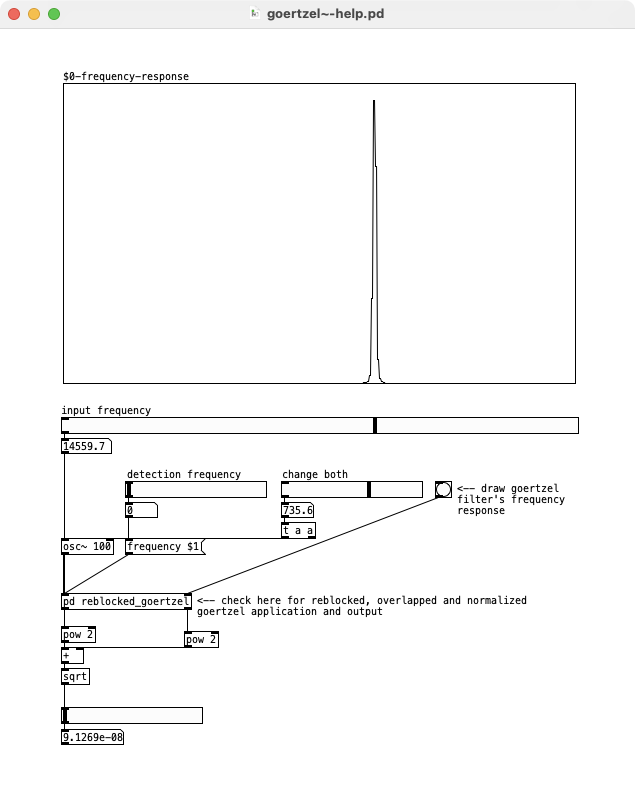

# goertzel~ external for Pd (Pure Data)

This external is a simple implementation of the Goertzel algorithm as described on https://www.mstarlabs.com/dsp/goertzel/goertzel.html

creation argument:
* `<float>` - detection frequency

1st inlet expects:
* incoming audio signal
* `[frequency $1(` message for setting the detection frequency

1st outlet:
* real component of Goertzel filter result

2nd outlet:
* imaginary component of Goertzel filter result

